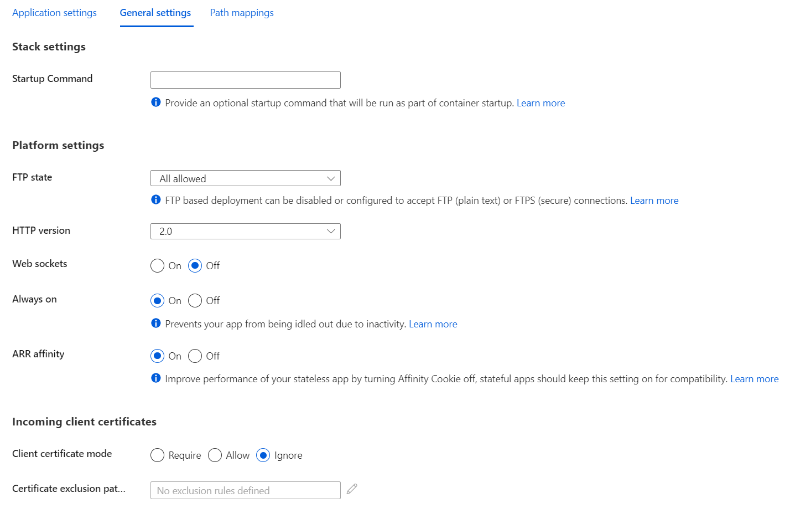

# Azure App Service

## Overview

Azure App Service is an HTTP-based service for hosting:
- web applications,
- REST API,
- mobile back-end.

Runs natively:
- on Windows,
- on Linux,
- Linux containers.

Features:
- Can scale up/down or scale out/in.
- Continous integration/deployment with Azure DevOps, GitHub, BitBucket, FTP, or a local Git repository on a development machine.
- Deployment slots (only in Standard and Premium plan tiers).

Limitations:
- Shared pricing tier does not support Linux.
- Cannot mix Windoes and Linux apps in the same App Service plan.

## Azure App Service Plans

Each Azure App Service plan defines:
- region,
- number of VMs,
- size of VMs,
- pricing tier.

Pricing tiers:
- **Shared compute**: both **Free** and **Shared** share resource pools with other customers.
- **Dedicated compute**: the **Basic**, **Standard**, **Premium**, **PremiumV2**, and **PremiumV3** tiers run app on dedicated Azure VMs. The hier the tier, the more VM instances are available for scale-out.
- **Isolated**: run dedicated Azure VMs on dedicated Azure Virtual Networks. Provides maximum scale-out capabilities.
- **Consumption**: only available for _function apps_. Scales dynamically depending on workload.

All apps run on all VM instances configured in the App Service plan.

## Manual Deployment

Supports:
- Git
- CLI
- Zip deploy
- FTP/S

## Built-in Authentication

Identity providers:
- Microsoft Identity Platform
- Facebook
- Google
- Twitter

## Multitenant App Service Networking Features

Inbound features:
- **App-assigned address**: IP-based SSL, unshared dedicated address.
- **Access restrictions**: restrict access from a set of well-defined addresses.
- **Service endpoints**
- **Private endpoints**

Outbound features:
- **Hybrid Connections**
- **Gateway-required VNet Integration**
- **VNet Integration**

## App Service Settings

Consists of:
- Application settings
- General settings
- Path mappings
  - IIS hadler mapings (only for Windows)
  - Mount storage

## Diagnostic Logging

| Type | Platform |
|------|----------|
| Application logging | Windows, Linux |
| Deployment logging | Windows, Linux |
| Web server logging | Windows |
| Detailed error logging | Windows |
| Failed request tracing | Windows |

## Feature Flags

Use **Azure App Confuguration** to manage application feature flags from a centralised place.

## Auto-scale

App service can:

- **scale out**: increases instance number when **any** scale out rule from a condition is met,
- **scale in**: decreases instance number when **all** scale in rules from a condition are met.

Conditions can be:
- based on a metric,
- based in a schedule.

_Time grain_ - period of time while autoscale rule aggregates the values for a metric (in most cases is 1 minute).
_Duration_ - longer, user-specified period of time when autoscale rule performs further aggregation of the values collected from the _time grain_ (minimum is 5 minutes).

## Deployment Slots

Available in the following tiers:
- standard,
- premium,
- isolated.

Settings that are swapped:
- General settings (such as framework settings, 32/64-bit, web sockets)
- App settings (can be configured to stick to a slot)
- Connection strings (can be configured to stick to a slot)
- Handler mappings
- Public certificates
- WebJobs content
- Hybrid connections *
- Service endpoints *
- Azure Content Delivery Network *
- Path mappings

Features marked with an asterisk (*) are planned to be unswapped.

Settings that aren't swapped:
- Publishing endpoints
- Custom domain names
- Non-public certificates and TLS/SSL settings
- Scale settings
- WebJobs schedulers
- IP restrictions
- Always On
- Diagnostic log settings
- Cross-origin resource sharing (CORS)
- Virtual network integration
- Managed indentities
- Settings that end with the suffix `_EXTENSION_VERSION`

Warm-up app settings:
- `WEBSITE_SWAP_WARMUP_PING_PATH` - relative path to ping during warm-up. An example is `/statuscheck`.
- `WEBSITE_SWAP_WARMUP_PING_STATUSES` - valid HTTP response codes for the warm-up operation. An example is `200,202`.

Use `x-ms-routing-name` query parameter to manually route to a specific slot. Once routed, browser will stick to that route by using cookie with the same name. Examples:
- `/?x-ms-routing-name=staging` - route to "staging" slot,
- `/?x-ms-routing-name=self` - route to the production slot.
