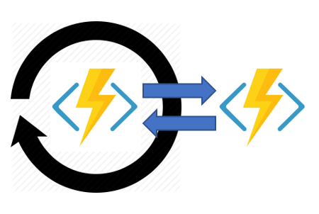

# Azure Durable Functions

## Overview

Durable Functions is an extension of Azure Functions. Durable Functions can be used for stateful orchestration of function execution.

You pay only when Durable Function runs, orchestrator function is deallocated when it awaits for an async operation result. It remembers the state and once async operation result is ready, function logic is replayed. Therefore code should be *deterministic*: orchestrator function will be replayed multiple times, and it must produce the same result each time.

## Application Patterns

Typical application patterns that can benefit from Durable Functions:

- Function chaining  


- Fan-out / fan-in  


- Async HTTP APIs  


- Monitoring  


- Human interaction  


- Aggregator (stateful entities)  


## Durable Function Types

- **Orchestrator function**: describes how actions are executed.
- **Activity functions**: basic unit of work that is orchestrated.
- **Entity function**: define operations for reading and updating small pieces of state. These entities are called *durable entities*.
- **Client function**: client function delivers message to the *task hub*. These messages are used to trigger orchestration or entity functions. Client function can be triggered manually from Azure Portal.

## Task Hubs

A task hub is a logical container for durable storage resources that are used for orchestrations and entities. Orchestrator, activity, and entity functions can interact with each other only when they are belong to the same task hub.

There might be multiple task hubs in a single Azure Storage Account, distinguished by alphanumeric names that start with a letter and the length is between 3 and 45 characters.

Hub name is specified in the hosts.json file:
```json
{
  "version": "2.0",
  "extension": {
    "durableTask": {
      "hubName": "MyTaskHub"
    }
  }
}
```