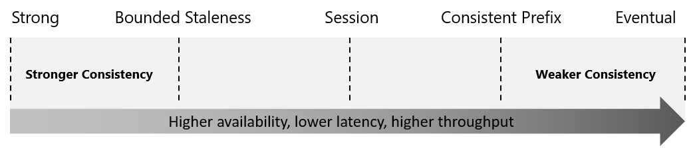

# Azure Cosmos DB

## Overview

Key benefits:
- unlimited elastic write and read scalability,
- 99.999% read and write availability for multi-region databases,
- guaranteed reads and writes served in less than 10 milliseconds at the 99th percentile.

## Azure Comsos DB Elements

- **Acount** - can contain multiple databases.
Maximum 50 Azure Cosmos accounts under an Azure subscription (soft limit).

- **Database** - unit of management for a set of Azure Cosmos containers.

- **Container** - fundamental unit of scalability. A container is horizontally partitioned and then replicated across multiple regions. Throughput is configured in one of the following modes:

  - dedicated provisioned throughput mode,
  - shared provisioned throughput mode.

- **Item** - unit of data (row in a table, or document in a collection).

## Consistency Levels

Developers make a choice between high availability and performance by choosing one of the consistency levels:

- strong
- bounded staleness
- session
- consistent prefix
- eventual

## Supported APIs

- Core (SQL) API
- API for MongoDB
- Cassandra API
- Table API
- Gremlin API

## Request Units (RUs)

Payment is made base on the the throughput provisioned and the storage consumed on an hourly basis. Throughput must be provisioned to ensure that sufficient system resources are available for Azure Cosmos database at all times.

RU represents the system resources (CPU, IOPS, and memory) that are required to perform the database operations supported by Azure Cosmos DB - point read fetching a single item by its ID and partition key value for a 1KB item is 1RU.

There are three Azure Cosmos account modes:
- **Provisioned throughput mode**: the number or RUs in provisioned in a per-second basis in increments of 100 RUs per second.

- **Serverless mode**: get billed for the amount of RUs that has been consumed by your database operations.

- **Autoscale mode**: can automatically and instantly scale the throughput (RU/s) based on it's usage.

## Partitions

- **Logical partition**: consists of items that have the same partition key. Also defines the scope of database transaction.

- **Physical partition**: constainer is scaled by distributing data and throughput across physical partitions. Physical partitions are entirely managed by Azure Cosmos DB.

One or more logical partitions are mapped to a single physical partition.

The number of physical partitions in a container depends on the following:

- the number of throughput provisioned (up to 10,000 RU/s per physical partition),
- the total data storage (up to 50GB of data per physical partition).

Physical partition with too many requests is called "hot".

## Partition Keys

Partition key has two components:

- **Partition key path**: for example `/userId`. Can accept alphanumeric and `_` characters.
- **Partition key value**: can be of string or numeric types.

Partition key should be a value that:
- does not change,
- has high cardinality,
- spreads RU consumption and data storage evenly acress all logical partitions.

If property that can be used as a partition key does not exist in data, then a **synthetic partition key** can be created.
