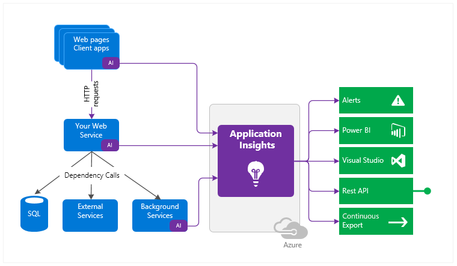

# Azure Monitor

## Overview

Azure Monitor delivers a comprehensive solution for collecting, analyzing, and acting on telemetry from your cloud and on-premises environments.

Azure Monitor can collect data from a variety of sources:

- applications,
- guest OS,
- Azure resource,
- Azure subscription,
- Azure tenant.

All data collected by Azure Monitor fits into one of two fundamental types:

- **metrics**: numerical values that describe some aspect of a system at a particular point of time. They are lightweight and capable of supporting near real-time scenarios.
- **logs**: data organized into records with different sets of properties for each type. Telemetry such as events and traces are stored as logs in addition to performance data so that it can all be combined for analysis.

## Insights and Curated Visualizations

Some Azure resources providers have a **curated visualization** which gives a customized monitoring experience for that particular service or set of services. Larger scalable curated visualizations are known as **insights** and marked with that name in the documentation and Azure portal.

Some examples:

- Application Insights,
- Container Insights,
- VM Insights.

## Application Insights

Application Insights is an extensible Application Performance Management (APM) service for monitoring live applications.

Application Insights works by installing a small instrumentation package (SDK) in an application or enabled using the Application Insights Agent when supported. Telemetry data is directed to an Azure Application Insights Resource using a unique GUID that is referred as an Instrumentation Key.

In addition, telemetry can be pulled form the host environments such as performance counters, Azure diagnostics, or Docker logs.

All these telemetry streams are integrated into Azure Monitor.

Application Insights monitors the following:

- Requests rates, response times, and failure rates.
- Dependency rates, response times, and failure rates.
- Exceptions.
- Page views and load performance.
- AJAX calls.
- User and session counts.
- Performance counters.
- Host diagnostics.
- Diagnostic trace logs.
- Custom events and metrics.

There are several ways to get started monitoring and analyzing app performance:

- **At run time**: instrument web app on the server. Ideal for applications already deployed. Avoids any update to the code.
- **At development time**: add Application Insights to the code. Allows to customize telemetry collection and send additional telemetry.
- **Instrument web pages**: for page view, AJAX, and other client-side telemetry.
- **Analyze mobile app usage**: by integrating with Visual Studio App Center.
- **Availability tests**: ping website regularly from Azure servers.

## Log-based Metrics

There are two types of metrics:

- **Log-based metrics** behind the scenes are translated into _Kusto queries_ form stored events.
- **Standard metrics** are stored as pre-aggregated time series.

## App Monitoring Instrumentation

### Auto-instrumentation

Allows to enable app monitoring without changing the code. Only enabling, and sometimes configuring, the agent is required, which collects telemetry automatically.

### Instrumenting for Distributed Tracing

Distributed tracing is the equivalent of call stacks for modern cloud and microservices architectures, with the addition of a simplistic performance profiler. 
There are two experiences for consuming distributed trace data:

- **Transaction diagnostics view**: provides visibility into one single transaction/request.
- **Application map view**: aggregates many transactions to show a topological view of how the systems interact, and what the average performance and error rates are.

## Availability Tests

It's possible to set up recurring tests to monitor availability and responsiveness. Application Insights sends web requests to an application at regular intervals from points around the world. It can alert if application isn't responding or responds too slowly.

Up to 100 availability tests per Application Insights resource can be created.

There are three types of availability tests:

- **URL ping test (classic)**: a simple test to validate whether a public endpoint is responding and measure performance associated with that response. Custom success criteria and more advanced features, like allowing retries, can be set.
- **Standard test (preview)**: similar to URL ping test, but includes SSL certificate validity, proactive lifetime check, HTTP request verb, custom headers, and custom request data.
- **Custom `TrackAvailability` test**: custom application to run availability tests. Can be used for multi request or authentication test scenarios.
