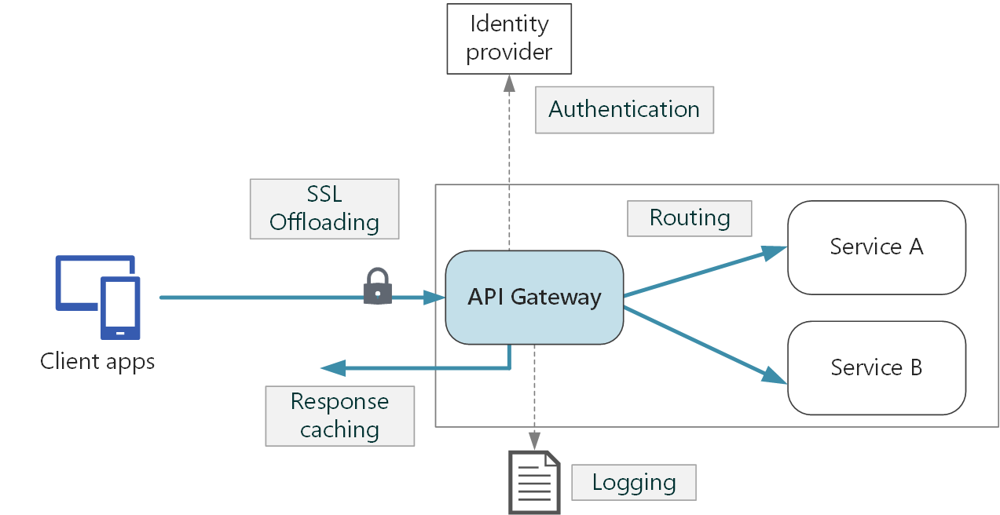

# API Management Service

## Overview



API Gateway is capable of:
- SSL termination
- Authentication
- IP allow/block lists
- Request rate limiting
- Logging and monitoring
- Response caching
- GZIP compression
- Serving static content

## Structure

Each API consists of one or more operations, and each API can be added to one or more products. To use API, developers subscribe to a product that contains that API, and then they can call the API's operation, subject to any usage policies that mey be in effect.

The system is made up of the following components:

- **API gateway**: API endpoint.
- **Azure portal**: for administrators to manage APIs.
- **Developer portal**: for developers to learn about APIs, view and call operations, and subscribe to products.

### Products

Products are how APIs are surfaced to developers. Product have one or more APIs, and are configured with a title, description, and terms of use. Products can be:

- **Open**: can be used without subscription.
- **Protected**: must be subscribed to before it can be used.

Subscription approval is configured at the product level and can either require administrator approval, or be auto-approved.

### Groups

Groups are used to manage the visibility of products to developers. API Management has the following immutable system groups:

- **Administrators**: manage API Management service instances, creating the APIs, operations, and products.
- **Developers**: customers that build application using APIs.
- **Guests**: can be granted certain read-only access, such as the ability to view APIs but not call them.

### Developers

Developers represent the user accounts in an API Management service instance. Developers can be created or invited to join by administrators, or they can sign up from the Developer portal. Each developer is a member of one or more groups, and can subscribe to the products that grant visibility to those groups.

## API Management Policies

Policies allow to change the behavior of the API through configuration. Policies are a collection of Statements that are executed sequentially in the request or response of an API.

Policies are applied inside the gateway which sits between the API consumer and the managed API. Policy can apply changes to both the inbound request and outbound response.

The policy definition is a simple XML document that describes a sequence of statements. The configuration is divided into `inbound`, `backend`, `outbound`, and `on-error` sections. Example:
```xml
<policies>
  <inbound>
    <base />
  </inbound>
  <backend>
    <base />
  </backend>
  <outbound>
    <base />
    <choose>
      <when condition="@(context.Response.StatusCode == 200 && context.Product.Name.Equals("Starter"))">
        <set-body>
          @{
            var response = context.Response.Body.As<JObject>();
            foreach (var key in new [] {"minutely", "hourly", "daily", "flags"}) {
              response.Property (key).Remove ();
            }
            return response.ToString();
          }
        </set-body>
      </when>
    </choose>
  </outbound>
  <on-error>
    <base />
  </on-error>
</policies>
```

### Advanced Policy Examples

Control flow:
```xml
<choose>
  <when condition="Boolean expression | Boolean constant">
    <!-- one or more policy statements to be applied if the above condition is true  -->
  </when>
  <when condition="Boolean expression | Boolean constant">
    <!-- one or more policy statements to be applied if the above condition is true  -->
  </when>
  <otherwise>
    <!-- one or more policy statements to be applied if none of the above conditions are true  -->
  </otherwise>
</choose>
```

Forward request:
```xml
<forward-request timeout="time in seconds" follow-redirects="true | false"/>
```

Limit concurrency:
```xml
<limit-concurrency key="expression" max-count="number">
  <!-- nested policy statements -->
</limit-concurrency>
```

Log to Event Hub:
```xml
<log-to-eventhub
  logger-id="id of the logger entity"
  partition-id="index of the partition where messages are sent"
  partition-key="value used for partition assignment"
>
  <!-- Expression returning a string to be logged -->
</log-to-eventhub>
```

Mock response:
```xml
<mock-response status-code="code" content-type="media type" />
```

Retry:
```xml
<retry
  condition="boolean expression or literal"
  count="number of retry attempts"
  interval="retry interval in seconds"
  max-interval="maximum retry interval in seconds"
  delta="retry interval delta in seconds"
  first-fast-retry="boolean expression or literal"
>
  <!-- One or more child policies. No restrictions -->
</retry>
```

## Security

API Management also supports the following mechanisms for securing access to APIs:
- Subscriptions
- OAuth 2.0
- Client certificates
- IP allow listings

### Subscriptions

Access to API can be secured by using subscription keys. Consumers of the published APIs must include a valid subscription key in HTTP requests - in the `Ocp-Apim-Subscription-Key` header or as the `subscription-key` query parameter. A subscription key is a unique auto-generated and can be scoped to different areas:
- All APIs
- Single API
- Product

### Client Certificates

Certificates can be used to provide TLS mutual authentication between the client and the API gateway. Configuration is done through inbound policies.

The following properties can be validated:
- Certificate Authority (CA)
- Thumbprint
- Subject
- Expiration Date

In the Consumption Tier, the use of client certificates must be enabled explicitly on the **Custom domains** page.

Example of configuration:
```xml
<choose>
  <when condition="@(context.Request.Certificate == null || context.Request.Certificate.Thumbprint != "desired-thumbprint")" >
    <return-response>
      <set-status code="403" reason="Invalid client certificate" />
    </return-response>
  </when>
</choose>
```